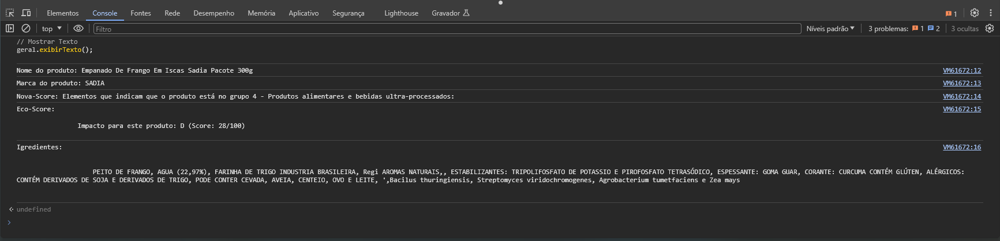

<h1 align = "center"> Desafio Devnology <h1>
<h3 align = "center"> By Bieelx <h3>

Criar um comando para ser utilizado no Console.log que consegue extrair as pincipais informações da página 

## 🚀 Tecnologias

Esse projeto foi desenvolvido com as seguintes tecnologias:
- JavaScript

## 💻 Projeto
Utilizar o Query para extrair informações da página.

## 🌐 Página Utilizada
https://br.openfoodfacts.org/produto/7891515439118/empanado-de-frango-em-iscas-sadia-pacote-300g
